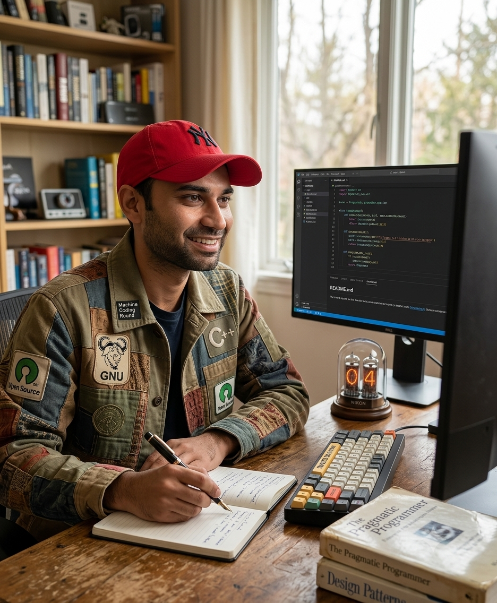

# React Machine Coding Challenges

A collection of **16 React machine coding interview problems** to practice React fundamentals, state management, API integration, forms, animations, and UI development.

  

## Tech Stack

- **Framework:** React
- **Language:** JavaScript (ES6+)
- **Styling:** CSS3
- **Data Fetching:** Fetch API

## Projects

| # | Project | Description |
|---|---------|-------------|
| 1 | Accordion | Expand and collapse sections. |
| 2 | Contact Form | Submit user details and feedback. |
| 3 | Holy Grail | Build the classic Holy Grail layout. |
| 4 | Progress Bars | Animate progress bars on render. |
| 5 | Flight Booker | Book one-way or return flights. |
| 6 | Temperature Converter | Convert Celsius and Fahrenheit. |
| 7 | Tabs | Switch between tab panels. |
| 8 | Data Table | Display users with pagination. |
| 9 | Dice Roller | Simulate rolling six-sided dice. |
| 10 | Like Button | Toggle like/unlike state. |
| 11 | Star Rating | Select a rating using stars. |
| 12 | Todo List | Add and delete tasks. |
| 13 | Traffic Light | Simulate traffic light transitions. |
| 14 | Digital Clock | Display the current time. |
| 15 | Tic-Tac-Toe | Two-player Tic-Tac-Toe game. |
| 16 | Job Board | Fetch and display Hacker News job postings. |